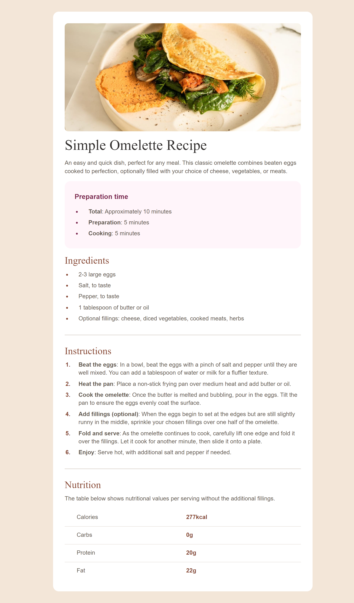

# Frontend Mentor - Recipe page solution

This is a solution to the [Recipe page challenge on Frontend Mentor](https://www.frontendmentor.io/challenges/recipe-page-KiTsR8QQKm). Frontend Mentor challenges help you improve your coding skills by building realistic projects. 

## Table of contents

- [Overview](#overview)
  - [Screenshot](#screenshot)
  - [Links](#links)
- [My process](#my-process)
  - [Built with](#built-with)
- [Author](#author)

## Overview

### Screenshot

### Links

- Solution URL: [Solution URL here](https://www.frontendmentor.io/solutions/responsive-recipe-page-BeVVRrf87m)
- Live Site URL: [Live site URL here](https://thaarcadeguy.github.io/recipe-page/)

## My process

### Built with

- Semantic HTML5 markup
- CSS custom properties
- Flexbox

## Author

- Discord - [thaArcadeGuy](https://discord.com/channels/@me)
- Frontend Mentor - [@thaArcadeGuy](https://www.frontendmentor.io/profile/thaArcadeGuy)
- X - [@thaArcadeGuy](https://www.x.com/thaArcadeGuy)

